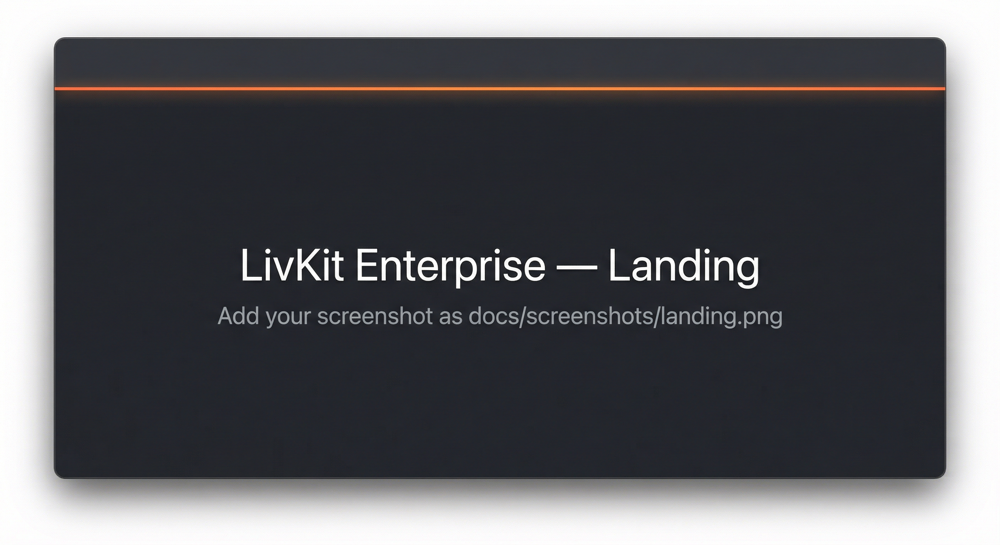
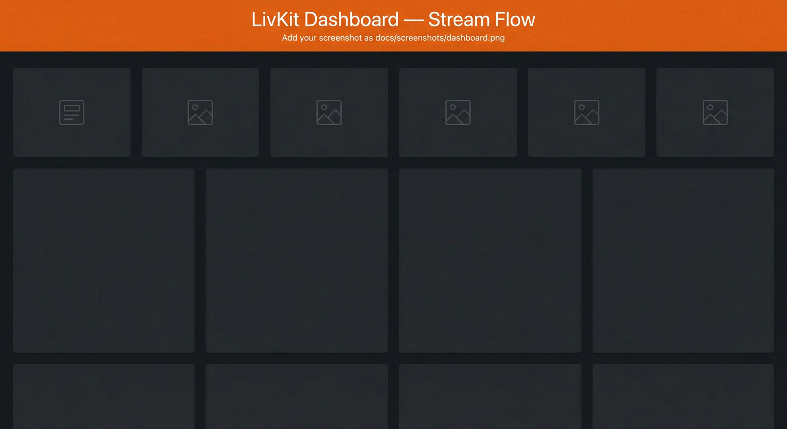

# LivKit

**Enterprise dashboard for LiveKit** — real-time infrastructure, Convex backend, Coolify deployment. One app to sign in, deploy LiveKit on your VPS, and manage nodes, sessions, analytics, diagnostics, modules, vault, and terminal.

---

## Screenshots

*Placeholders below. Replace with your own: save a screenshot of your deployed app as `docs/screenshots/landing.png` (landing) or `docs/screenshots/dashboard.png` (dashboard home). See [docs/screenshots/README.md](docs/screenshots/README.md).*

| Landing | Dashboard (after sign-in) |
|--------|---------------------------|
| [](docs/screenshots/landing.png) | [](docs/screenshots/dashboard.png) |

**To use your own screenshots:** Save a capture of your landing page as `docs/screenshots/landing.png` and of the dashboard as `docs/screenshots/dashboard.png`. They will appear above. See [docs/screenshots/README.md](docs/screenshots/README.md).

---

## Features

| Area | What you get |
|------|----------------|
| **Auth** | Convex Auth (email/password, JWT). Sign in / sign up and protected dashboard routes. |
| **Deploy** | Trigger LiveKit Stack deployment on your VPS via Coolify (webhook or API). One-click from the dashboard. |
| **Nodes** | Sync Coolify applications as infrastructure nodes; view name, region, status, last heartbeat. |
| **Sessions** | Live or demo session data; LiveKit webhook feeds room/participant events into the Sessions view. |
| **Analytics** | Traffic flow and region egress (real or seeded demo metrics). Stream Flow and region bars. |
| **Diagnostics** | Convex events timeline; load Coolify logs for Dashboard and LiveKit Stack; export CSV. |
| **Modules** | Enable/disable stack modules (LiveKit, TURN, Recording). Seed defaults and toggle in the UI. |
| **Vault** | Store and list keys in Convex; optional read-only Coolify env key names (values never stored). |
| **Agents** | Voice AI agents (AgentsJS). Run the agent worker from `agent/`; dispatch the agent to a room from the dashboard. |
| **Terminal** | Command history in Convex; load Coolify logs for LiveKit Stack; status filter (all / success / failed). |

## Architecture (high level)

```
┌─────────────────┐     ┌──────────────────┐     ┌─────────────────┐
│  Next.js App    │────▶│  Convex          │────▶│  Coolify / VPS  │
│  (Dashboard)    │     │  (Auth, DB,      │     │  (LiveKit Stack)│
│  Port 3000      │     │   Actions, HTTP) │     │  Docker Compose │
└─────────────────┘     └──────────────────┘     └─────────────────┘
        │                          │                        │
        │  NEXT_PUBLIC_CONVEX_URL  │  COOLIFY_BASE_URL      │  LIVEKIT
        │  NEXT_PUBLIC_APP_URL     │  COOLIFY_API_TOKEN     │  WebSocket
        └──────────────────────────┴────────────────────────┘
```

- **Frontend:** Next.js (App Router), Convex React, Tailwind-style UI.
- **Backend:** Convex (queries, mutations, actions, HTTP routes, cron).
- **Deploy:** Coolify for Dashboard (Next.js) and LiveKit Stack (Docker Compose).

## Prerequisites

- **Node.js** 18+
- **Convex** account ([convex.dev](https://convex.dev))
- **Coolify** (optional, for VPS deploy) — [coolify.io](https://coolify.io)
- **LiveKit** — server runs via Docker Compose from this repo’s `deploy/` directory

## Quick start (local)

1. **Clone and install**
   ```bash
   git clone https://github.com/YOUR_USERNAME/YOUR_REPO.git
   cd YOUR_REPO/frontend
   npm install
   cp .env.example .env.local
   ```

2. **Convex**
   - Create a project at [dashboard.convex.dev](https://dashboard.convex.dev)
   - In `frontend/.env.local` set:
     - `NEXT_PUBLIC_CONVEX_URL` = your Convex deployment URL (e.g. `https://your-deployment-123.convex.cloud`)

3. **Run**
   ```bash
   cd frontend
   npm run convex:dev    # terminal 1
   npm run dev           # terminal 2
   ```
   Open [http://localhost:3000](http://localhost:3000). Sign up, then use the Dashboard and Deploy sections.

## Environment variables

Set these for **local development** in `frontend/.env.local`. For **production** (e.g. Coolify), set them in your hosting dashboard.

| Variable | Description | Example (demo only) |
| -------- | ----------- | -------------------- |
| `NEXT_PUBLIC_CONVEX_URL` | Convex deployment URL | `https://your-deployment.convex.cloud` |
| `NEXT_PUBLIC_APP_URL` | Public URL of this app (auth cookies) | `https://your-app.example.com` |
| `NEXT_PUBLIC_LIVEKIT_URL` | LiveKit server WebSocket URL | `ws://YOUR_VPS_IP:7880` |
| `COOLIFY_DEPLOY_WEBHOOK_URL` | (Optional) Coolify deploy webhook for LiveKit Stack | From Coolify → app → Webhook |
| `COOLIFY_BASE_URL` | Coolify API base URL | `http://YOUR_VPS_IP:8000` |
| `COOLIFY_API_TOKEN` | Coolify API token (Deploy permission) | From Coolify → Keys & Tokens |
| `LIVEKIT_STACK_APP_UUID` | Coolify app UUID for LiveKit Stack | From Coolify → your LiveKit app |
| `NEXT_PUBLIC_COOLIFY_BASE_URL` | (Optional) For “View in Coolify” link on Deploy page | Same as `COOLIFY_BASE_URL` |
| `NEXT_PUBLIC_COOLIFY_DASHBOARD_APP_UUID` | (Optional) Dashboard app UUID for Coolify logs/env | From Coolify → Dashboard app |
| `NEXT_PUBLIC_COOLIFY_LIVEKIT_STACK_APP_UUID` | (Optional) LiveKit Stack app UUID for Deploy prefill, logs | From Coolify → LiveKit Stack app |

See [docs/ENV-VARS.md](docs/ENV-VARS.md) for Convex and Coolify env vars. Template: [frontend/.env.example](frontend/.env.example).

## Deploy with Coolify

### 1. Dashboard app (Next.js)

- **Source:** Your GitHub repo (this repo or your fork).
- **Build:** Use the Dockerfile at repo root (builds `frontend/`).
- **Port:** 3000.
- **Environment:** Set `NEXT_PUBLIC_CONVEX_URL` to your **production** Convex URL. Optionally set `COOLIFY_DEPLOY_WEBHOOK_URL`, `NEXT_PUBLIC_LIVEKIT_URL`, `NEXT_PUBLIC_APP_URL`, `COOLIFY_BASE_URL`, `COOLIFY_API_TOKEN`, `LIVEKIT_STACK_APP_UUID` as needed (see [docs/DASHBOARD-SETUP-CHECKLIST.md](docs/DASHBOARD-SETUP-CHECKLIST.md)).
- **Health check:** In Coolify, set path to `/api/health` and port to `3000` so the app is marked healthy.
- **Auth / cookies:** Ensure your proxy forwards **Host** (or **X-Forwarded-Host**) and **X-Forwarded-Proto** so auth cookies use your public domain.

### 2. LiveKit Stack app (Docker Compose)

- Add a second application in Coolify: type **Docker Compose**, source = this repo, **Docker Compose path** = `deploy/docker-compose.yml`, **Base directory** = `deploy`.
- Copy the app’s **Deploy webhook URL** and set `COOLIFY_DEPLOY_WEBHOOK_URL` on the Dashboard app, **or** use the API method with `COOLIFY_BASE_URL`, `COOLIFY_API_TOKEN`, and `LIVEKIT_STACK_APP_UUID`.
- Full Coolify + LiveKit setup: [docs/LIVEKIT-COOLIFY-SETUP.md](docs/LIVEKIT-COOLIFY-SETUP.md).

### 3. Automatic deployment on push to GitHub

When you push to the `main` branch, a GitHub Action triggers Coolify to redeploy your Dashboard app so you don’t have to deploy manually.

**One-time setup:** In your GitHub repo go to **Settings → Secrets and variables → Actions** and add:

| Secret | Value |
|--------|--------|
| `COOLIFY_TOKEN` | Your Coolify API token (Coolify → Keys & Tokens) |
| `COOLIFY_BASE_URL` | Your Coolify URL, e.g. `https://coolify.yourdomain.com` or `http://YOUR_VPS_IP:8000` |
| `COOLIFY_DASHBOARD_APP_UUID` | The UUID of your Dashboard application in Coolify (from the app’s URL or Coolify API) |

After these are set, every `git push origin main` runs the **Deploy to Coolify** workflow and triggers a new deploy. Check the **Actions** tab for run history.

**Auto-push after commit:** A Git post-commit hook (Husky) runs `git push origin HEAD` after each commit so your branch is pushed automatically. To disable it, remove or comment out the contents of [.husky/post-commit](.husky/post-commit).

### 4. Convex production

- Deploy the Convex backend:
  ```bash
  cd frontend
  npx convex deploy
  ```
  Choose **production**. Set `NEXT_PUBLIC_CONVEX_URL` in Coolify to your production Convex Cloud URL.

## Convex

- **Development:** `npm run convex:dev` (uses Convex dev deployment).
- **Production:** `npm run convex:deploy` (prompts for production).
- **Codegen:** `npm run convex:codegen` (regenerate API types).

**Auth (JWT):** If you see `Missing environment variable JWT_PRIVATE_KEY`, run once per deployment:
```bash
cd frontend
npm run convex:auth:env          # dev
npm run convex:auth:env -- --prod   # production
```

**LiveKit webhook:** Point your LiveKit server at `https://<your-deployment>.convex.site/livekit-webhook` so room/participant events appear in Sessions. Use the Convex action `livekit.generateToken` (with `LIVEKIT_API_KEY` and `LIVEKIT_API_SECRET` in Convex env) for client tokens.

### Mobile / client integration

Use **short-lived access tokens** for mobile or web clients; do not ship API keys in the app.

1. **Convex env:** Set `LIVEKIT_API_KEY` and `LIVEKIT_API_SECRET` in your Convex deployment (Settings → Environment variables). These are also used to **verify LiveKit webhook** requests (signature check on `/livekit-webhook`).
2. **Token generation:** Call the Convex action `livekit.generateToken` with `roomName` (and optional `participantName`, `ttlSeconds`, `metadata`, `attributes`). The default TTL is 30 minutes for self-hosted; pass `ttlSeconds` (e.g. `3600`) to override. Your backend should invoke this action and return the token to the client.
3. **Token refresh:** On self-hosted, tokens are not revoked when a participant is removed. Use short-lived tokens and have the client request a new token from your backend when reconnecting or when the token is about to expire (LiveKit SDKs can use token callbacks).
4. **Client:** The mobile or web app receives the token and connects to `NEXT_PUBLIC_LIVEKIT_URL` (or your LiveKit server URL) using the LiveKit SDK; it never sees the API key or secret.

See [docs/LIVEKIT-CONVEX-WEBHOOK-SETUP.md](docs/LIVEKIT-CONVEX-WEBHOOK-SETUP.md) for webhook verification and token details.

## Documentation

| Doc | Description |
| --- | ----------- |
| [docs/ONE-TIME-SETUP.md](docs/ONE-TIME-SETUP.md) | Checklist: GitHub secrets, LiveKit webhook, Convex env, Modules (auto-deploy + live data) |
| [docs/DASHBOARD-SETUP-CHECKLIST.md](docs/DASHBOARD-SETUP-CHECKLIST.md) | One-time setup so all dashboard sections work |
| [docs/DASHBOARD-FUNCTIONALITY-PLAN.md](docs/DASHBOARD-FUNCTIONALITY-PLAN.md) | Plan to add real functionality to each section |
| [docs/ENV-VARS.md](docs/ENV-VARS.md) | Full environment variable reference |
| [docs/LIVEKIT-COOLIFY-SETUP.md](docs/LIVEKIT-COOLIFY-SETUP.md) | LiveKit Stack on Coolify and token usage |
| [docs/LIVEKIT-CONVEX-WEBHOOK-SETUP.md](docs/LIVEKIT-CONVEX-WEBHOOK-SETUP.md) | Webhook + Convex env for Sessions and tokens |
| [docs/TROUBLESHOOTING.md](docs/TROUBLESHOOTING.md) | Common issues and how to fix them |
| [deploy/README.md](deploy/README.md) | LiveKit stack (Docker Compose, Redis, Coturn) |

## Voice AI agents

A voice agent (STT → LLM → TTS) lives in **`agent/`** and runs as a separate Node process. It uses [@livekit/agents](https://docs.livekit.io/agents/) (AgentsJS) with OpenAI and Silero VAD.

- **Run locally:** `cd agent && npm install && npm run start` (or `npm run dev` for watch). Set `LIVEKIT_URL`, `LIVEKIT_API_KEY`, `LIVEKIT_API_SECRET`, and `OPENAI_API_KEY` (see [agent/README.md](agent/README.md)).
- **Dispatch:** From the dashboard **Agents** page, use “Dispatch agent to room” to send the agent into a room. The agent registers as `livkit-voice-agent`.
- **Deploy:** Optionally run the agent as a second service (e.g. Docker or Coolify) on your VPS; the dashboard can dispatch it to rooms when it is connected to your LiveKit server.

## Project layout

| Path | Description |
| ---- | ----------- |
| `frontend/` | Next.js app (Convex auth, dashboard, deploy UI) |
| `agent/` | Voice AI agent worker (AgentsJS); run with `npm run start` |
| `deploy/` | LiveKit stack (Docker Compose, Redis, Coturn, egress) |
| `docs/` | Setup checklists, env reference, screenshots |
| `scripts/` | Asset and reference scripts |

## Built with

- [Next.js](https://nextjs.org) · [Convex](https://convex.dev) · [Convex Auth](https://github.com/get-convex/convex-auth) · [LiveKit](https://livekit.io) · [Coolify](https://coolify.io)

## License

See repository license or your project terms.
